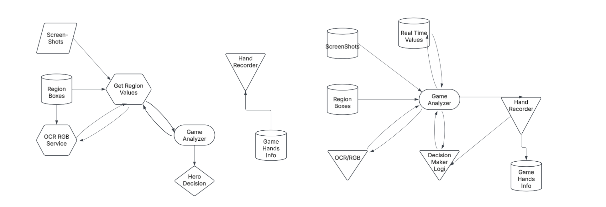
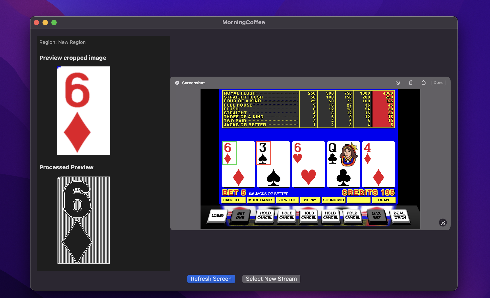
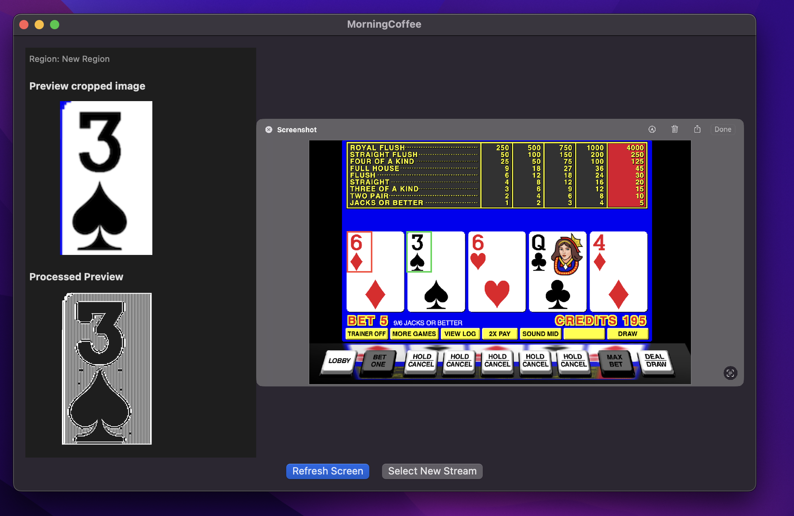
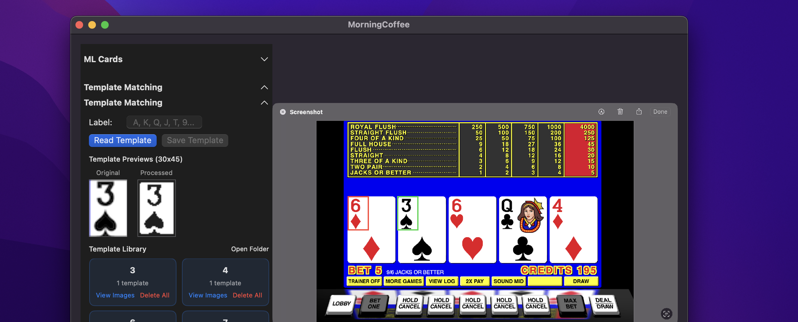

# Swift Poker Bot
Swift Poker Bot is an application that processes poker tables and tracks the game state, allowing integration with an LLM or a Bayesian Belief Network (BBN), or other solutions, to determine the ideal decision.

I built this project to explore automated decision-making and to showcase large-scale software architecture. It combines computer vision, multiple OCR methods, Custom ZNCC Template matching, and AI reasoning in an attempt to replicate a professional poker player.


## Project Overview & Current State
Right now there are two apps:

*They originally had coffee-themed names, which I’m in the process of changing.*


- **Table Maker (MorningCoffee)**  
  This is up and working. It lets users draw ROIs on poker windows, name them, and save them. It also provides a full toolbox of controls to preprocess images, save images for ML, and more.

- **Poker Bot (Coffee)**  
  The prototype is working but not uploaded yet. This is the part that actually plays — it processes the table map, figures out what’s going on, and then relies on an LLM or BBN to decide an action.

The code works, but it is still a prototype with many areas for improvement and simplification. I have a list of planned additions, modifications, and simplifications, which I’ll be adding at the bottom.


## Technical Architecture
<p align="center">
  
</p>
<p align="center"><em>These Figures are some of the prototypes I used when designing the system, I had a good idea on what was needed but had to put it together. As a WARNING these displayed diagrams are not accurate representations of the code base, just some of my initial designs.</em></p>


### Table Stream 
 * Capturing still images from a live feed using Apple's CGWindow API 

### Regions of Interest
 * Rectangle Object (Hard coded dimensions)
 * Currently cut from the current img stream, then processed and analyzed with Table Reading
 * Fills into a custom 'player' object (cards, balance, action, etc...)

### Table Reading
 * Apple's Vision VN get text (Current)
 * Template Matching (Current)
 * RGB Matching (Current)
 * Apples CoreML (Deprecated)
 * Tesseract (Deprecated)
 
 
### Game State Management
 * Custom Data Structure 

### Deciding Action 
 * Direct LLM integration with pre-generated prompts available based on game state

 

### Automated Action
 * 


## UI Preview


<p align="center">
  
  
</p>

<p align="center">
  <em>Figure: Processed regions output from Table Reader</em>
</p>

### Table Reader
- **Screen Capture Engine** - Apple CGWindow API–based capture with custom data structures for maintaining and rendering dynamic regions.
- **Optical Character Recognition (OCR)** - Apple Vision, from custom user defined preprocessing pipeline's
- **Region Mapping System** - Visual interface for defining table elements
- **Confidence Tracking** - Reliability scoring across all recognition methods
- **Training Data Collection** - Automated dataset generation for model improvement
<p align="center">
  
</p>

<p align="center">
  <em>Figure:Template Matcher UI, allows users to save and label a template, view pre-existing ones, delete incorrect ones from memory, and test accuracy of current readings (Need to normalize scale to percent)</em>
</p>


### PokerBot
- **Game State Parser** - Converts visual data into structured game information
- **LLM Integration** - Uses pre-trained language models for strategic reasoning
- **Bayesian Networks** - 
- **Game Types** - NLH (8-MAX), More to Come later
## Key Features
### Advanced Computer Vision
- **Multi-modal OCR** with automatic fallback systems
- **Custom CoreML models** for card recognition (A, K, Q, J, T, 9-2)
- **Real-time confidence scoring** and accuracy tracking
- **Preprocessing optimization** for challenging poker interface elements
### Smart Decision Making
- **LLM reasoning** for complex strategic situations
- **BBN probability analysis** planned, for uncertainty management
- **Profitable play optimization** focused on long-term value generation
### Data Collection & Training
- **Rapid Collection Mode** - Batch capture with automatic tagging
- **Training Data Export** - TIFF images with ground truth for OCR training
- **CoreML Dataset Generation** - Raw images organized for custom model training
- These are 3 separate pieces that I will combine later into a single simplified  interface
## Installation & Setup
### Prerequisites
- macOS (silicon)
- Xcode for compilation
- Screen Recording & Accessibility permissions
- Homebrew package manager
### Dependencies

```bash
brew install tesseract
```

I will be updating this potential problems you could run into, and how to fix them

## Reviewing Logs

 ```Logs

 Started new hand with dealer at seat 2
⚠️ WARNING: Low confidence (0.6423138) for player card: 'Empty'
Waiting for hero cards (frame 1)
Holding preflopDetect (hold frame 1)
Seat 7 confirmed in hand (frame 3)
Seat 0 confirmed in hand (frame 3)
Seat 6 confirmed in hand (frame 3)
Seat 5 confirmed in hand (frame 3)
Seat 4 confirmed in hand (frame 3)
Seat 1 confirmed in hand (frame 3)
Seat 2 confirmed in hand (frame 3)
Holding preflopDetect (hold frame 2)
HandData: Added action - Seat 4: SB 0.1 on preflop
HandData: Added action - Seat 5: BB 0.2 on preflop
Auto-posted: Seat 4 posts SB $0.1
Auto-posted: Seat 5 posts BB $0.2
```
I need to change the cash values to Big Blinds or betting units to make a uniform single source of truth 

```Logs
⚠️ WARNING: Low confidence (0.3) for PlayerBalance OCR - Text: ':w***'
🔧 BALANCE: ':w***' → ':w***' → ':w***' → ':w***'
⚠️ Retrying balance read for seat 7
⚠️ WARNING: Low confidence (0.3) for PlayerBalance OCR - Text: ':w***'
🔧 BALANCE: ':w***' → ':w***' → ':w***' → ':w***'
HandData: Set starting stack for seat 7: $1000.0
❌ Could not read seat 7 balance, using default $1000
⚠️ WARNING: Low confidence (0.3) for PlayerBalance OCR - Text: '444.70 вB'
🔧 BALANCE: '444.70 вB' → '444.70' → '444.70' → '444.70'
HandData: Set starting stack for seat 4: $444.7
⚠️ WARNING: Low confidence (0.5) for PlayerBalance OCR - Text: '306.13 BB'
🔧 BALANCE: '306.13 BB' → '306.13' → '306.13' → '306.13'
HandData: Set starting stack for seat 6: $306.13
⚠️ WARNING: Low confidence (0.5) for PlayerBalance OCR - Text: '261.43 BB'
🔧 BALANCE: '261.43 BB' → '261.43' → '261.43' → '261.43'
HandData: Set starting stack for seat 5: $261.43
🔧 BALANCE: '197.75 BB' → '197.75' → '197.75' → '197.75'
HandData: Set starting stack for seat 0: $197.75
⚠️ WARNING: Low confidence (0.3) for PlayerBalance OCR - Text: 'soinie'
🔧 BALANCE: 'soinie' → 'soinie' → '50inie' → '50inie'
⚠️ Retrying balance read for seat 2
⚠️ WARNING: Low confidence (0.3) for PlayerBalance OCR - Text: 'soinie'
🔧 BALANCE: 'soinie' → 'soinie' → '50inie' → '50inie'
HandData: Set starting stack for seat 2: $1000.0
❌ Could not read seat 2 balance, using default $1000
⚠️ WARNING: Low confidence (0.5) for PlayerBalance OCR - Text: '194.13 BB'
🔧 BALANCE: '194.13 BB' → '194.13' → '194.13' → '194.13'
HandData: Set starting stack for seat 1: $194.13
```
The above logs represent one of the biggest problems with the current tech stack using VNTextRequest from Apple. We're only achieving about 80% success/accuracy rate on OCR for numerical bets. I've done a fair amount of preprocessing to ensure a clear image with white text on a black background but still get these poor reads, many are correct but with low confidence or are outright wrong. Apple didn't give the ability to train the provided API further unfortunately. I've tried implementing Tesseract and got a bit more reliable performance originally, but after completing a custom training session it degraded performance and I've since reverted back to Apple's. I really want to benchmark options to resolve reading the balance while finding a way to ensure accuracy and maintain speed. The bot isn't currently saving the poor OCR reads but I plan on adding that soon to assist with future trainings and testing/benchmarking other solutions. 

I reviewed Apple's documentation to make sure I'm not missing anything; only takeaways were doing fast OCR over accurate (accurate performs better for.... )


```
HandData: Set cards for seat 0: [Monster.Cards(rank: "4", suit: "C"), Monster.Cards(rank: "8", suit: "C")]
Captured hero cards: 4C 8C
Captured initial hand data for 7 players
Player detection complete, moving to preflop action
Action order: [6, 7, 0, 1, 2, 4, 5]
HandData: Added action - Seat 6: STRADDLE 0.4 on preflop
Seat 6 posts STRADDLE $0.4
Action order rotated after straddle from seat 6
[preflopAction] actionOrder: [7, 0, 1, 2, 4, 5, 6]
[preflopAction] hasActed: [:]
[preflopAction] closedSeats: []
[preflopAction] Next actor: seat 7
preflopAction seat 7 OCR action: 'Fold'
HandData: Added action - Seat 7: fold nil on preflop
✅ Seat 7: FOLD
⚠️ WARNING: Low confidence (0.5) for TablePot OCR - Text: '4.38 BB'
🔧 POT: '4.38 BB' → '4.38' → '4.38' → '4.38'
HandData: Updated pot size: $4.38

```

In constant I have no issues 
An important update is making balances set to only read big blinds and providing all balances in BB form. This single truth should help with some OCR accuracy with a structured BB being read 

*Highlight: Poker Tables have a standard of letting players choose between BB or chip mode. For most sites going in BB modes adds the letters BB to all the end of any bet or balance amount. This gives a bit more structure to work with for training models. 

Also above it's currently using 

```
============================================================
🤖 HERO'S TURN TO ACT 🤖
============================================================
   You are an online poker pro.
   You are tasked with making the best decision.
============================================================
HAND HISTORY:
Dealer: Seat 2
Pot: 4.4bb
Hero Cards: 4C 8C
PREFLOP:
  Seat 4: SB 0.5bb
  Seat 5: BB 1bb
  Seat 6: STRADDLE 2.0bb
  Seat 7: FOLD
CURRENT EFFECTIVE STACKS: (Not displayed - focus on BB action)
============================================================
⚡ Please respond with the best action we can take ⚡
============================================================
```

```
[preflopAction] actionOrder: [0, 1, 2, 4, 5, 6]
[preflopAction] hasActed: [7: true]
[preflopAction] closedSeats: []
[preflopAction] Next actor: seat 0
⚠️ WARNING: Low PLAYERACTION confidence (0.0) for PlayerAction OCR - Text: 'nil'
… waiting on seat 0…
⚠️ WARNING: Low PLAYERACTION confidence (0.0) for PlayerAction OCR - Text: 'nil'
⚠️ WARNING: Low PLAYERACTION confidence (0.0) for PlayerAction OCR - Text: 'nil'
preflopAction seat 0 OCR action: 'Raise'
BEFORE reopenAndRotate: actionOrder = [0, 1, 2, 4, 5, 6]
AFTER reopenAndRotate: actionOrder = [1, 2, 4, 5, 6, 0]
⚠️ WARNING: Low confidence (0.3) for PlayerBet OCR - Text: '5 BB'
🔧 BET: '5 BB' → '5' → '5' → '5'
💰 OCR bet for seat 0: raw='5' → cleaned='5' → amount=5.0BB
⚠️ WARNING: Low confidence (0.5) for PlayerBalance OCR - Text: '192.75 вB'
🔧 BALANCE: '192.75 вB' → '192.75' → '192.75' → '192.75'
✅ OCR balance for seat 0: 192.75BB
HandData: Updated balance for seat 0: $192.75
HandData: Added action - Seat 0: raise 5.0 on preflop
✅ Seat 0: RAISE 5.0BB
[preflopAction] actionOrder: [1, 2, 4, 5, 6, 0]
[preflopAction] hasActed: [2: false, 6: false, 1: false, 4: false, 0: true, 5: false, 7: true]
[preflopAction] closedSeats: []
[preflopAction] Next actor: seat 1
⚠️ WARNING: Low PLAYERACTION confidence (0.0) for PlayerAction OCR - Text: 'nil'
… waiting on seat 1…
⚠️ WARNING: Low PLAYERACTION confidence (0.0) for PlayerAction OCR - Text: 'nil'
preflopAction seat 1 OCR action: 'Call'
⚠️ WARNING: Low confidence (0.0) for PlayerBet OCR - Text: 'nil'
💰 OCR bet for seat 1: raw='' → cleaned='' → amount=nilBB
⚠️ WARNING: Low confidence (0.5) for PlayerBalance OCR - Text: '189.13 BB'
🔧 BALANCE: '189.13 BB' → '189.13' → '189.13' → '189.13'
✅ OCR balance for seat 1: 189.13BB

 ```


Work on the Logging don't print if it's nil 
Just print the thing 
Switch it to fast not accurate 

Go over the print first each one 

-Print what's read if not nil and if it needed cleaning

HAVE a separate warnings for percents 
 
 
 OCR LOG's'
 Bet LOG 
 Balance LOG 
 Pot LOG 
 
 Action LOG 
 Cards LOG Com + Player
 
 Save img to a folder 
 (Save in the best format)
 (Save with all relevant info) read value, percent, in correct folders, correct name, robust and make sure folders work 
 One log for the recorded amount and img and stuff 
 Plus the same game runtime log 

I wanna improve the Logging that I'm doing for OCR on players bets, eventually we will do the same concept to the ML Card, and other OCR things. But I wanna perfect players bets first.

A few things I need to work, what are all the locations that we are editing or modifying the string that was read from OCR when we are doing players bets, help me break down that pipeline, so I can make sure we're not doing anything redundant.

Next need to Consider all the logs, right now we print things to console I still wanna do that but need to start implementing a universal log system, I wanna have many logs that store different things that are the important info from running it and post warnings. 
I wanna have the best categories for my logging so need to decide which ones we will use? 
we may need new logs I'm not doing yet. 


## Planned Backlog
- [ ] Ensure we aren't overscraping 
- [ ] Simplify the preprocessing Pipeline 
  - [ ] Remove all the Heavy preprocessing 
  - [ ] Pick and Refine the most optimized options
- [ ] Refine ZNCC Templating
- [x] Re-add the SB and BB not blinds 
- [ ] Account for the All-In blinds edge case 
- [ ] Make Preprocessing instructions saveable to the table map
- [ ] Convert the Poker Bot to an anchor system 
- [x] MAKE The Text Edit More Uniform (Money formatting)
- [ ] Optimize Bot's RGB Detection
- [ ] Make Mapped table seats a modular number (locked at 8 rn)
- [ ] Redesign the img capture pipeline to benefit from Apple's robust API

